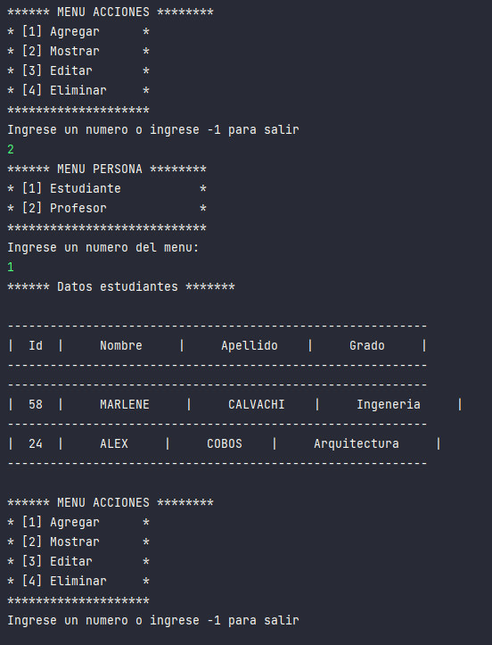

# POO CRUD con Arreglos en Java
Practica CRUD con manejo de Arreglos y Programacion Orientado a Objetos en Java, sistema de ingreso de Profesores y Estudiantes

## Inicio del programa menu principal

## Inicio del programa menu submenu

## Mostrar datos

## Agregar datos Estudiante

## Agregar datos Profesor

## Actualizar datos Estudiantes

## Eliminar un estudiante

## Finalizar el programa
